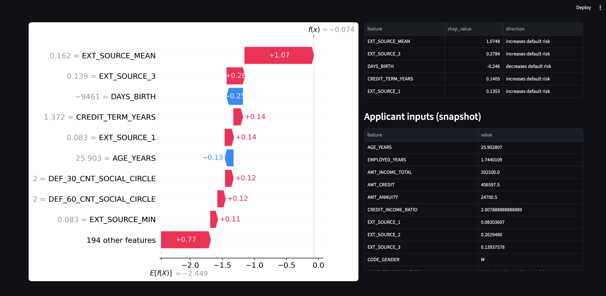

# Loan Decision AI Audit & Reliability Framework

Trust infrastructure for an auto-decisioning loan model: explainability,
drift monitoring, fairness audit, and a feedback loop that retrains on
analyst corrections. Built on the public Home Credit Default Risk
dataset (Kaggle).

The project's premise: a fintech is auto-decisioning ~60% of loan
applications, but compliance won't sign off on removing manual review
because the model has no reason codes, no drift detection, and no
feedback loop. This repository builds the layer that fixes that.



## Project layout

```
PROJECT_1/
├── config/
│   └── config.yaml                  # Paths, schema, hyperparameters
├── data/
│   ├── raw/home-credit-default-risk/        # Kaggle CSVs (download separately)
│   ├── interim/
│   └── processed/                            # Engineered parquet
├── notebooks/
│   ├── 01_data_loading_eda_feature_engineering.ipynb
│   ├── 02_xgboost_mlflow.ipynb
│   ├── 03_shap_fairness.ipynb
│   ├── 04_drift_monitoring.ipynb
│   └── 05_feedback_loop.ipynb
├── src/
│   ├── data/loader.py               # Schema-aware loader, sentinel handling, dtype downcasting
│   ├── features/build_features.py   # Domain features + ColumnTransformer pipeline
│   ├── models/
│   │   ├── train.py                 # XGBoost training + early-stopping
│   │   └── evaluate.py              # PR-AUC, ROC-AUC, recall@precision, plots
│   ├── audit/
│   │   ├── shap_explain.py          # TreeSHAP wrapper + plotting
│   │   └── fairness.py              # Sliced metrics + four-fifths-rule check
│   ├── monitor/drift.py             # PSI, synthetic time-windows, performance tracker
│   ├── feedback/correction.py       # Analyst-error identification + augmented retraining
│   ├── dashboard/app.py             # Streamlit audit UI
│   └── utils/                       # Config, logging, MLflow helpers
├── artifacts/                       # Fitted preprocessor, MLflow runs, audit/monitoring/feedback CSVs
└── requirements.txt
```

## Setup

```bash
python -m venv .venv && source .venv/bin/activate
pip install -r requirements.txt
```

On macOS, XGBoost additionally needs OpenMP:

```bash
brew install libomp
```

## Get the data

The Home Credit Default Risk dataset is a (closed) Kaggle competition;
data remains downloadable.

**Kaggle CLI:**

```bash
pip install kaggle
kaggle competitions download -c home-credit-default-risk -p data/raw/
unzip data/raw/home-credit-default-risk.zip -d data/raw/home-credit-default-risk/
```

Or download manually from https://www.kaggle.com/c/home-credit-default-risk/data
and unzip into `data/raw/home-credit-default-risk/`.

## Steps

### Step 1 — Data, EDA, feature engineering

`notebooks/01_data_loading_eda_feature_engineering.ipynb`

Loads `application_train.csv`, handles Home Credit's two known sentinels
(`DAYS_EMPLOYED == 365243` and the `XNA` literal), downcasts numeric
dtypes for ~30% memory savings, and produces an engineered feature frame
plus a fitted `ColumnTransformer` that downstream steps consume.

Domain features include `CREDIT_INCOME_RATIO`, `ANNUITY_INCOME_RATIO`,
`AGE_YEARS`, `EMPLOYED_AGE_RATIO`, `EXT_SOURCE_MEAN/MIN/MAX/STD`. They
are named for credit officers, not data scientists, so SHAP reason
codes downstream read as "high debt-to-income" instead of "AMT_CREDIT
high". Median imputation + one-hot encoding; no scaling because XGBoost
is scale-invariant and SHAP values stay in interpretable units.

**Artifacts:** `data/processed/application_train_engineered.parquet`,
`artifacts/preprocessor.joblib`, `artifacts/feature_names.json`.

### Step 2 — XGBoost classifier + MLflow tracking

`notebooks/02_xgboost_mlflow.ipynb`

Stratified 80/20 split, retrained XGBoost with histogram splitting and
early stopping watching validation PR-AUC (not log-loss — eval-metric
order matters for early stopping; a silent bug if you don't check).
Class imbalance handled by keeping the natural distribution rather than
`scale_pos_weight`, because the compliance-driven Streamlit dashboard
tunes thresholds on the business cost matrix and calibration beats
upweighted recall there.

The booster is sliced to `best_iteration` before MLflow logs it — the
saved model *is* the model, with no implicit "remember to set
iteration_range" contract for downstream consumers. A round-trip
assertion in the notebook catches the bug where this isn't done; it
flagged a 6.5% prediction gap between in-memory and serialized predict
during development.

Validation PR-AUC ≈ 0.26 vs base rate 0.08 — a 3.2× lift on the
applicant snapshot alone. MLflow logs the model, preprocessor, feature
names, params, metrics, and three diagnostic plots (PR, ROC,
calibration) as one atomic run, backed by SQLite.

### Step 3 — SHAP explainability + fairness audit

`notebooks/03_shap_fairness.ipynb`

TreeSHAP values computed on the full 61K-row validation set (exact, not
sampled — auditors don't accept "approximately attributed" reason
codes). Global feature importance dominated by `EXT_SOURCE_*` and the
engineered ratios. Per-applicant waterfall + reason codes provide the
adverse-action-notice format the ECOA requires.

Fairness audit by gender and income decile, at a *realistic* operating
threshold (15% rejection rate, not the default 0.5 where everyone gets
approved). Headline finding: gender disparity ratio = 0.884 — passing
the EEOC four-fifths rule by 4 percentage points, with `CODE_GENDER`
directly in the model. The framework *surfaced* a real issue; a
production remediation would retrain without protected attributes and
re-audit. Income decile audit was clean (smallest ratio 0.92).

All audit artifacts logged to the same MLflow run as the model — the
audit and the thing it audits live together.

### Step 4 — Drift monitoring (PSI + Evidently)

`notebooks/04_drift_monitoring.ipynb`

Simulated six months of production scoring by injecting documented bias
schedules per month (income up, younger applicants, more retirees, lower
bureau scores, severe combined drift). Computed PSI per feature against
the training reference for every month, ran an Evidently data-drift
report on the worst-drifted month, and tracked PR-AUC and approval rate
over time.

Drift trajectory was monotonic in severity: 0 → 7 significant-drift
features across six months. `EXT_SOURCE_2` hit PSI = 2.0 in Month 6,
eight times the "significant" threshold. Mean predicted score tracked
actual base rate even under drift — the model stayed calibrated, which
validates the Step 2 decision to skip `scale_pos_weight`.

Monitoring artifacts attached to the same MLflow run as the model + the
audit. Compliance asks "did THIS model exhibit drift?", not "what did
the drift system do in May?" — the answer is one query, not a join.

### Step 5 — Feedback loop simulation

`notebooks/05_feedback_loop.ipynb`

Three-way split (train / production-pool / test) so corrections are
sampled from one held-out set and evaluation happens on another,
never-seen set. Identified high-confidence false positives (score ≥
0.30) and false negatives (score ≤ 0.03) in the production pool;
sampled balanced correction batches of 100; augmented the training set
with 3× sample weight on corrections; retrained; evaluated.

Each corrected model is logged as a nested MLflow child of the baseline,
so the lineage `baseline → corrected-v1 → -v2 → -v3` is queryable.

**Headline finding — the framework correctly blocked promotion.** Adding
100, 183, 246 high-confidence-error corrections with 3× weight slightly
*degraded* test PR-AUC (Δ -0.0025, -0.0037, -0.0016). None cleared the
+0.005 PR-AUC promotion gate. A naive feedback pipeline without this
gate would have shipped a worse model on the assumption that "analyst
corrections must help." Catching this is the value the framework
provides.

### Step 6 — Streamlit audit dashboard

`src/dashboard/app.py`

Launch with:

```bash
streamlit run src/dashboard/app.py
```

Three tabs:

- **Decision Explorer** — pick any applicant by ID (filter to high-risk
  / borderline / low-risk), see the model's score, the binary decision
  at the operating threshold, the actual outcome, the SHAP waterfall,
  the top-5 reason codes, and the applicant's input snapshot.
- **Drift Monitor** — severity counts by month, top-15 most-drifted
  features, performance trajectory plot. Reads from the CSVs logged by
  Step 4.
- **Model Versions** — every MLflow run with the headline tags
  (`audited`, `monitored`, `role`, `correction_batch`), plus a summary
  of the headline audit / drift / feedback metrics on the most recent
  run.

The app uses Streamlit's `cache_resource` and `cache_data` decorators so
the 307K-row scoring pass happens once at startup, and per-applicant
SHAP calculations are near-instant thereafter. Same MLflow + preprocessor
+ feature-names bundle that training uses — no train/serve skew.

## Running the notebooks

```bash
jupyter lab
```

Then open the notebooks under `notebooks/` in order. Each notebook
expects the previous step's MLflow run + artifacts to exist.

## Running the dashboard

```bash
streamlit run src/dashboard/app.py
```

Opens in your browser at `http://localhost:8501`. Requires Steps 1-5
to have been run at least once so the MLflow runs and CSV artifacts
exist.

## Browsing MLflow runs

```bash
mlflow ui --backend-store-uri sqlite:///artifacts/mlflow.db
```

Opens the MLflow UI at `http://localhost:5000`. Navigate to **Model
training** → `loan-default-baseline` to see runs.
